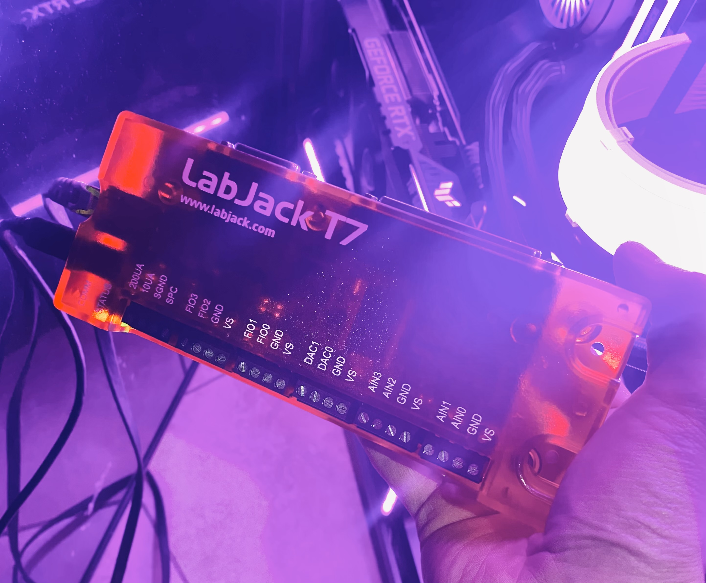

# LQD-DAQ

Ground-based Data Acquisition (DAQ) and control microservice for the liquid engine feed system, interfacing with the LabJack T7.

Still in the works, do not run installation packages without VMs / Docker.
